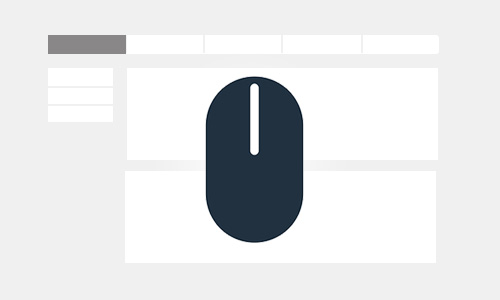

## (项目已停止维护，推荐使用HC-Sticky)

基本满足常见的网页fixed需求。

### 功能场景 ###

1. 滚动时固定元素
2. 锚点菜单定位

### 演示地址 ###

演示：**[Demo1](https://denghao.me/demo/2018/fixedScroll/demo1.html)** 、**[Demo2](https://denghao.me/demo/2018/fixedScroll/demo2.html)** 、**[Demo3](https://denghao.me/demo/2018/fixedScroll/demo3.html)** 、**[Demo4](https://denghao.me/demo/2018/fixedScroll/demo4.html)**

官方地址：[[点这里]](https://denghao.me/index.php/archives/fixedScroll.html)

### 使用说明 ###

  1.引入必要文件：jQuery、fixedScroll.js 。

    
    

  2.基础用法

    $(".box").fixedScroll()

  3.参数

    navEls : nav类名
    hookEls : 点击nav滚动到对应的元素
    hookOffset : 滚动元素的顶部偏移量
    offset : 固定元素的顶部偏移量
    stickEndEl : 固定元素结束位置
    callback(isFixed) : 滚动时触发，返回值isFixed为true表示已固定，false没固定

  4.方法

    resizeHeight()  : //高度变化时重新计算
